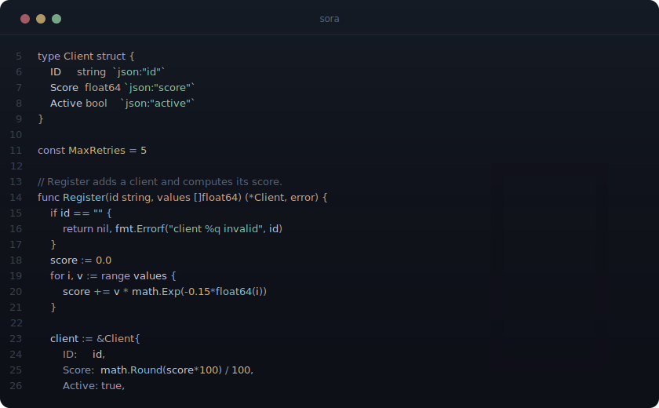

<p align="center">
  
  <br/><br/>
  A dark Neovim colorscheme. Ethereal cyan, cool silver, deep OLED blacks.
  <br/><br/>
  <a href="#installation">Install</a> &middot;
  <a href="#configuration">Configure</a> &middot;
  <a href="#palette">Palette</a> &middot;
  <a href="#supported-plugins">Plugins</a> &middot;
  <a href="#extras">Extras</a>
</p>

---

<p align="center">
  
</p>

## Philosophy

Sora sits between Tokyo Night's saturation and Lume's muted pastels. The background is near-black with a cool blue undertone, deep enough for OLED. Syntax colors are muted but readable - they don't compete with each other.

The signature ethereal cyan (`#80c8e0`) for functions is lighter and softer than Tokyo Night's blue, cooler than Lume's lavender. A single warm accent - gold (`#d4b878`) for constants and numbers - acts like a star against the cool palette. That one warm point in a field of cool tones is what gives Sora its look.

Eight named accents, each with a clear role. No neon, no Christmas tree.

## Installation

<details>
<summary><b>lazy.nvim</b></summary>

```lua
{
  "Aejkatappaja/sora",
  lazy = false,
  priority = 1000,
  opts = {},
  config = function(_, opts)
    require("sora").setup(opts)
    vim.cmd("colorscheme sora")
  end,
}
```

</details>

<details>
<summary><b>packer.nvim</b></summary>

```lua
use {
  "Aejkatappaja/sora",
  config = function()
    require("sora").setup()
    vim.cmd("colorscheme sora")
  end,
}
```

</details>

<details>
<summary><b>mini.deps</b></summary>

```lua
MiniDeps.add("Aejkatappaja/sora")
require("sora").setup()
vim.cmd("colorscheme sora")
```

</details>

## Configuration

```lua
require("sora").setup({
  transparent = false,
  italic_comments = true,

  on_colors = function(colors)
    -- colors.bg = "#000000"
  end,

  on_highlights = function(hl, colors)
    -- hl.Normal = { fg = colors.fg, bg = "#000000" }
  end,
})
```

## Palette

| Role       |                     Color                     | Hex       |
| :--------- | :-------------------------------------------: | :-------- |
| Background |  | `#0e1018` |
| Foreground |  | `#c8d0e0` |
| **Cyan**   |  | `#80c8e0` |
| Purple     |  | `#b0a0d8` |
| Sage       |  | `#90c8a0` |
| Peach      |  | `#d0a888` |
| Gold       |  | `#d4b878` |
| Rose       |  | `#d0909c` |
| Teal       |  | `#78b8b0` |
| Steel      |  | `#8898b8` |

## Supported Plugins

Sora includes highlight groups for:

- [telescope.nvim](https://github.com/nvim-telescope/telescope.nvim)
- [nvim-cmp](https://github.com/hrsh7th/nvim-cmp) / [blink.cmp](https://github.com/saghen/blink.cmp)
- [gitsigns.nvim](https://github.com/lewis6991/gitsigns.nvim)
- [nvim-tree.lua](https://github.com/nvim-tree/nvim-tree.lua) / [neo-tree.nvim](https://github.com/nvim-neo-tree/neo-tree.nvim) / [oil.nvim](https://github.com/stevearc/oil.nvim)
- [lualine.nvim](https://github.com/nvim-lualine/lualine.nvim) (built-in theme)
- [mini.statusline](https://github.com/echasnovski/mini.statusline)
- [indent-blankline.nvim](https://github.com/lukas-reineke/indent-blankline.nvim) / [snacks.nvim](https://github.com/folke/snacks.nvim)
- [which-key.nvim](https://github.com/folke/which-key.nvim)
- [trouble.nvim](https://github.com/folke/trouble.nvim)
- [lazy.nvim](https://github.com/folke/lazy.nvim) / [mason.nvim](https://github.com/williamboman/mason.nvim)
- [noice.nvim](https://github.com/folke/noice.nvim) / [nvim-notify](https://github.com/rcarriga/nvim-notify)
- [flash.nvim](https://github.com/folke/flash.nvim) / [fzf-lua](https://github.com/ibhagwan/fzf-lua)
- [render-markdown.nvim](https://github.com/MeanderingProgrammer/render-markdown.nvim)
- [dashboard-nvim](https://github.com/nvimdev/dashboard-nvim)
- [treesitter-context](https://github.com/nvim-treesitter/nvim-treesitter-context)

Full **Treesitter** and **LSP semantic token** support.

### Lualine

```lua
require("lualine").setup({
  options = { theme = "sora" },
})
```

## Extras

Sora everywhere:

| App | File | Install |
|:----|:-----|:--------|
| [Zed](https://zed.dev) | `extras/zed/sora.json` | Install from Zed extension store |
| [Ghostty](https://ghostty.org) | `extras/ghostty/sora` | `cp` to `~/.config/ghostty/themes/` |
| [Kitty](https://sw.kovidgoyal.net/kitty/) | `extras/kitty/sora.conf` | `include` in `kitty.conf` |
| [Alacritty](https://alacritty.org) | `extras/alacritty/sora.toml` | `import` in `alacritty.toml` |
| [Vim](https://www.vim.org) | `extras/vim/sora.vim` | `cp` to `~/.vim/colors/` |
| [Lazygit](https://github.com/jesseduffield/lazygit) | `extras/lazygit/sora.yml` | merge into `config.yml` |
| [Delta](https://github.com/dandavison/delta) | `extras/delta/sora.gitconfig` | `include` in `.gitconfig` |
| [fzf](https://github.com/junegunn/fzf) | `extras/fzf/sora.sh` | `source` in shell rc |
| [Yazi](https://yazi-rs.github.io) | `extras/yazi/sora.toml` | `cp` to `~/.config/yazi/theme.toml` |
| [btop](https://github.com/aristocratos/btop) | `extras/btop/sora.theme` | `cp` to `~/.config/btop/themes/` |
| [tmux](https://github.com/tmux/tmux) | `extras/tmux/sora.tmux.conf` | `source-file` in `tmux.conf` |
| [tokyo-night-tmux](https://github.com/janoamaral/tokyo-night-tmux) | `extras/tmux/tokyo-night-tmux-sora.sh` | see [tmux](#tmux) below |
| [Slack](https://slack.com) | `extras/slack/sora.txt` | paste in Slack sidebar theme |
| [Firefox](https://www.mozilla.org/firefox/) | `extras/firefox/manifest.json` | zip and load via `about:debugging` |

### tmux

For a basic tmux setup, add to your `tmux.conf`:

```bash
source-file /path/to/sora.nvim/extras/tmux/sora.tmux.conf
```

If you use [tokyo-night-tmux](https://github.com/janoamaral/tokyo-night-tmux), paste the contents of `extras/tmux/tokyo-night-tmux-sora.sh` into the plugin's `src/themes.sh` (before the default `*)` case), then add to your `tmux.conf`:

```bash
set -g @tokyo-night-tmux_theme "sora"
```

## License

MIT
